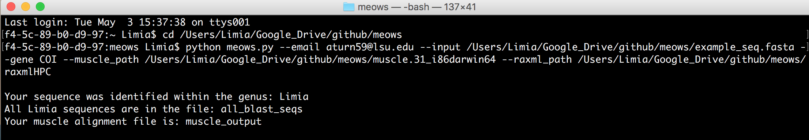
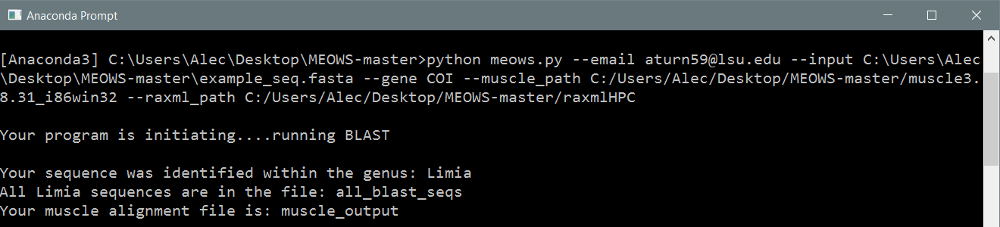
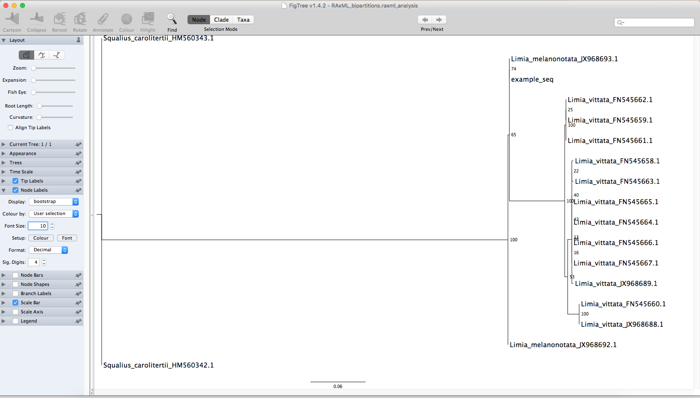

Title: README for MEOWS

Version: 0.1(4 May 2016)

Author: A.J. Turner --- created for BIOL 7800 at Louisiana State University

Created: April 2016

Edited: May 2016

MEOWS
=====

Multi-step Eliminating Operational Workflow for Sequences
---------------------------------------------------------

###Overview
Multi-step Eliminating Operational Workflow for Sequences, colloquially
called **MEOWS**, is a program used to automatically generate a maximum
likelihood phylogeny for its users. As a user, you simply input a FASTA
file that contains one sequence for your locus of interest. MEOWS uses **NCBI's
BLAST** to check the identify of the input sequence, returning the genus to
screen, and then proceeds to download sequence data for every species within
the specified genus for the locus under study. These sequences are then aligned
by creating a subprocess to **MUSCLE**, after which the `muscle_output` is then
subprocessed to **RAxML** to construct a maximum likelihood phylogeny (when viewed in FigTree).

###Program Requirements
In order to run MEOWS, you will need:

1. Python 3.5
  * link to [Python website](https://www.python.org/downloads/release/python-350/)
2. MUSCLE
  * link to [MUSCLE website](http://www.drive5.com/muscle/)
3. RAxML
  * link to [RAxML website](http://sco.h-its.org/exelixis/web/software/raxml/)
4. FigTree (visualize phylogeny)
  * link to [FigTree website](http://tree.bio.ed.ac.uk/software/figtree/)
 
######MEOWS was developed and tested with Apple OSX El Capitan 10.11.4, therefore, it is suggested that you use the same (if not similar) platform. Additionally, MEOWS has been successfully tested on a PC with Windows 10. Lastly, all Python code for MEOWS was developed using Python 3.5, therefore, MEOWS may be incompatible (at it's present state) with Python 2.7.

###Modules Used in Python:

~~~python
import argparse
from Bio import Entrez
from Bio import SeqIO
from Bio.Blast import NCBIXML
from Bio.Blast import NCBIWWW
import time
import subprocess
import shlex
~~~

######If you are unfamiliar with the abovementioned modules, I suggest finding the documentation for each one and browsing through it.

###Example --- How to use MEOWS
**Before starting the example, please download the `meows` directory and save it to your computer. Within the same directory, you should have (manually place) your `MUSCLE executable file` and `RAxML executable file`.**

1. Open bash (commandline) and set your working directory to the path of the `meows` directory. 
  * In the `meows` directory, there is a FASTA file containing the sequence of *Limia melanonotata* (GenBank: JX968693.1; Alda *et al.*, 2013) cytochrome oxidase subunit I (COI) gene (called `example_seq.fasta`), as well as the code for MEOWS, `meows.py` (ignore PNG picture files).

2. Once you have set your working directory, you will need to enter (without < or > or ""):
  * `python meows.py --email <email address> --input <full path to example_seq.fasta> --gene <gene name> --muscle_path <full path to muscle execuitable file> --raxml_path <full path to raxml executable file>`
  * Hit return to run program
  * **Note: Your commandline code should look similar to the "Commandline Example Image (Mac or PC specific)" below, but with your own path to files. If you are working on Windows, your path should start with "C:\ " (make sure to use \ and not / when using windows). Additionally, you do not need `.exe` after the names of your executable files when entering their full path.**

3. Your directory will now be populated with:
  * all_blast_seqs
  * muscle_output
  * RAxML files (5)

4. Open FigTree, select "open" and choose the file named `RAxML_bipartitions.raxml_analysis` to visualize the phylogeny for *Limia* using the COI locus. An example of the phylogeny is found below ("Limia Phylogeny Example"). **Note: FigTree may prompt you with "Please select a name for these values", in which case type "bootstrap."**

**Commandline Example Image Mac:**

**Commandline Example Image PC:**

**Limia Phylogeny Example:**

###Troubleshooting Tips
If you have files previously generated by RAxML in the current working directory, you may get an error and the program may not run. To fix this issue, remove all RAxML files, **except the raxml executable file**, from the working directory.

###Acknowledgments
Ideas and coding suggestions for this program were provided by Fernando
Alda and Subir Shakya. Additional coding help was provided by Brant Faircloth and Michael Henson,
specifically dealing with the use of the subprocess module.

###Citations
1. A. Stamatakis: "RAxML Version 8: A tool for Phylogenetic Analysis and
Post-Analysis of Large Phylogenies". In Bioinformatics, 2014, open access.

2. Alda,F., Reina,R.G., Doadrio,I. and Bermingham,E. Phylogeny and biogeography of the Poecilia sphenops species complex (Actinopterygii, Poeciliidae) in Central America. *Mol. Phylogenet. Evol*. 66 (3), 1011-1026 (2013)

3. Edgar, R.C. (2004) MUSCLE: multiple sequence alignment with high accuracy and high throughput.
*Nucleic Acids Res*. 32(5):1792-1797

4. http://stackoverflow.com/questions/25362382 -- Using NCBI BLAST

5. https://www.biostars.org/p/131113/ -- Using NCBI BLAST

6. http://tree.bio.ed.ac.uk/software/figtree/ -- FigTree by Andrew Rambaut

